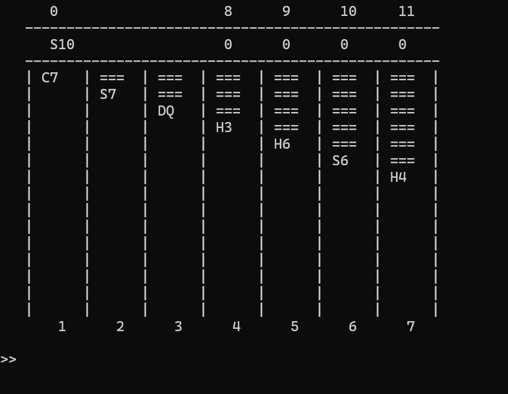

# Pasjans Klondike (Solitaire) – Project Showcase

## Project Overview

This project is a **console-based implementation of the Klondike Solitaire game** written in C++. The application recreates the core mechanics of the classic card game, allowing the user to play directly in the terminal. The project was developed as part of university coursework and focuses on logic, data structures, and program organization.

## Key Features

* Full Klondike Solitaire game logic
* Representation of cards, decks, and piles
* Shuffling and dealing cards according to Klondike rules
* Validation of moves based on game constraints
* Text-based user interface for interaction

## Implementation Summary

* Implemented **card representation** including suit, rank, and visibility (face up / face down)
* Created data structures for:

  * stock pile,
  * waste pile,
  * foundation piles,
  * tableau columns
* Used **object-oriented programming** to separate game logic from user interaction
* Implemented game rules such as:

  * alternating colors in tableau,
  * descending order in tableau piles,
  * ascending order in foundation piles
* Implemented card movement logic with validation to prevent illegal moves
* Used randomization to shuffle the deck at the start of each game

## Testing

* Verified correct deck creation (52 unique cards)
* Tested shuffling to ensure different game layouts on each run
* Tested legal and illegal moves between piles
* Checked correct revealing of cards after moves in tableau columns
* Performed manual gameplay tests to ensure the game can be completed without logic errors

Amelia Lipińska 203721
Alicja Szajgin 203383
